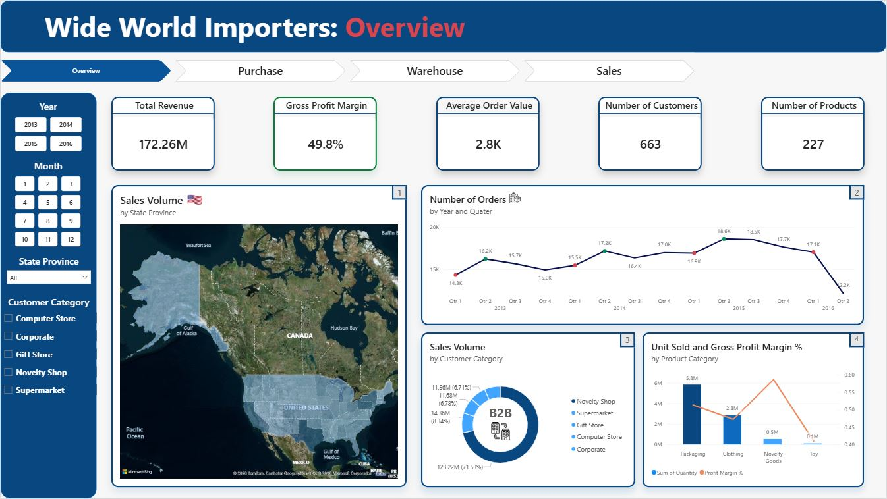

# Wide World Importers: Business Performance Analysis

## 📋 Background
Wide World Importers (WWI) is a wholesale novelty goods importer and distributor. This analysis examines business performance 
across Purchase, Warehouse, and Sales to identify operational inefficiencies and growth opportunities.

## ❓ Business Questions
Independently investigated potential operational issues across three core business areas and provided actionable recommendations:
- **Purchase**: Is our product strategy delivering value?
- **Warehouse**: Is our inventory under effective control?
- **Sales**: Are there any issues with our sales performance?

## 🛠️ Tools
| Tool | Purpose |
|------|---------|
| Power Query | Data transformation, ETL & table merging |
| Power Pivot | Data modeling & Snowflake Schema design |
| DAX | Custom measures & KPI calculations |
| Power BI | Visualization & reporting |

## 🔧 Data Preparation
- Restructured OLTP database into analytical **Snowflake Schema** (Full 1:* single) for Power BI optimization.
- Null and negative values **retained intentionally** — each carries **valid business meaning** within WWI's operational context.
- Built Fact/Dimension tables from **21 source tables**.
- Created **DAX measures**: Gross Profit Margin, Cancellation Rate, Retention Rate, AOV, Inventory Variance,
  Receipt-to-Issue Ratio, Consumption Rate, Stock Cover Years, etc.

## 🔍 Key Insights
1. **Purchasing Mismatch** — Order-driven vs Quantity-driven procurement causing inefficiency
2. **Inventory Data Integrity** — 6.6M unaccounted quantity making stock levels unreliable despite correct purchasing decisions
3. **Loss-making Orders** — $320K negative line profit from products sold below cost (Halloween zombie masks).

## 💡 Recommendations
* Each insight is presented with actionable next steps for relevant stakeholders:
- **Procurement team**: Shift to quantity-driven purchasing model.
- **Warehouse team**: Audit top 5 shrinkage items, implement stock reconciliation.
- **Sales team**: Review cost-floor pricing policy for loss-making SKUs.

## 📊 Dashboard

## ⚠️ Limitations
- Sample database — not real production data.
- Data period: 2013-2016.

## 📂 Data Source
[Wide World Importers](https://learn.microsoft.com/en-us/sql/samples/wide-world-importers-oltp-install-configure?view=sql-server-ver17)
— Microsoft Sample Database, MIT License.
